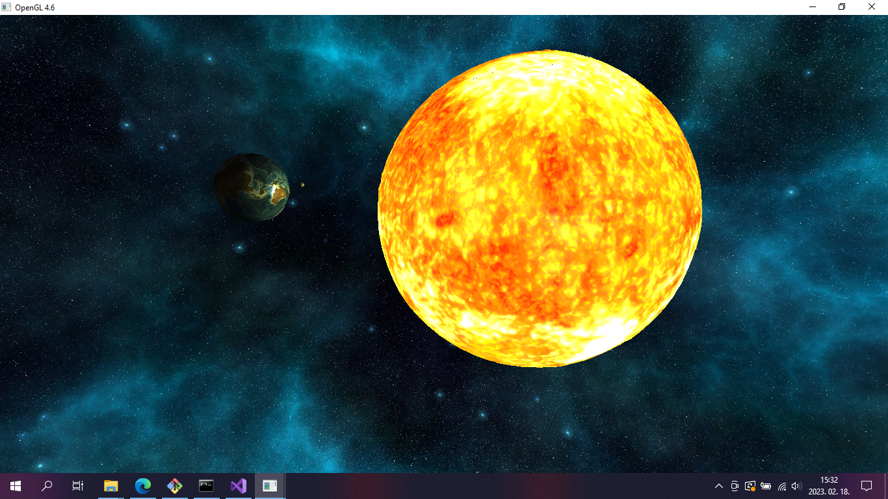

<h1>Space-Demo</h1>

A programmed OpenGL animation about the Earth, Moon and Sun.

How to run:
1. Open the command line and type: subst t: path\to\Space-Demo\01_OGLBase\includes
2. Build and run the project in Visual Studio.
3. The program will run from the IDE but it's also executable under Space-Demo\x64\Debug
4. To delete the virtual T: drive, go back to the command lineand type: subst \D t:

Controls:
<ul>
<li>Hold left mouse button and drag it to rotate the camera.</li>
<li>Use WASD to move the camera forward, left, right and back.</li>
<li>Hold any of the shift buttons while moving to move slower.</li>
<li>Press the spacebar to pause/continue the animation.</li>
</ul>

Copyright notice: This project was made using the OGLBase framework which is owned by ELTE's Department of Computer Science, therefore monetizing it is forbidden.
